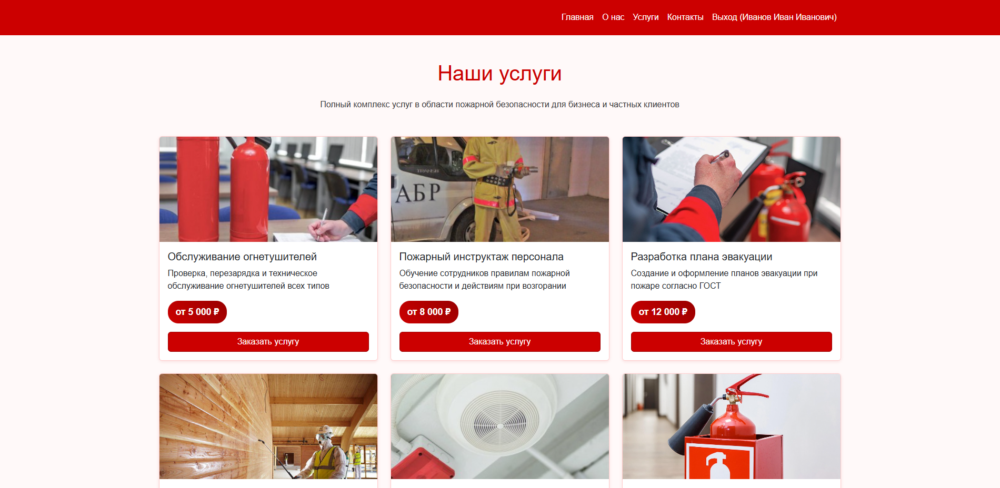
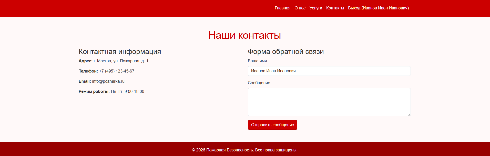
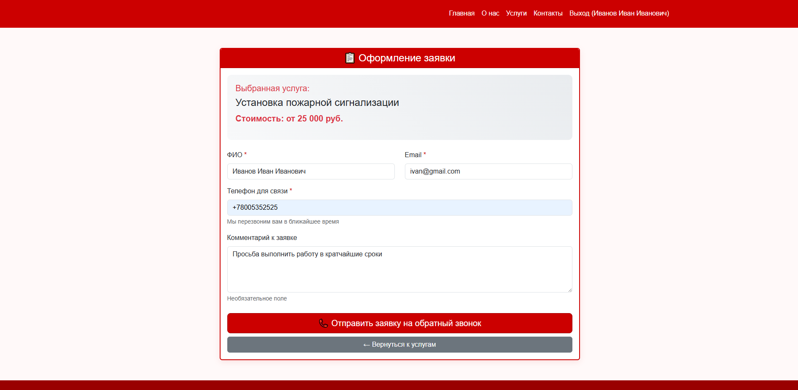
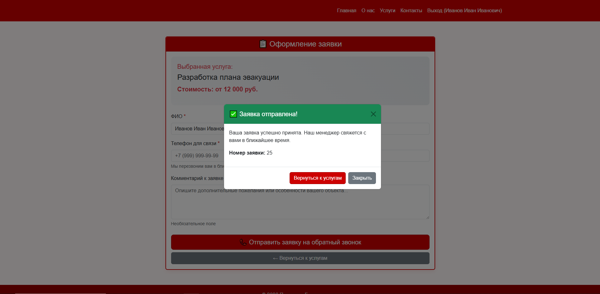
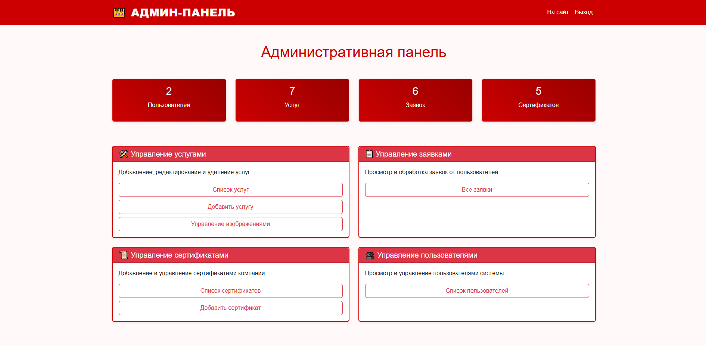
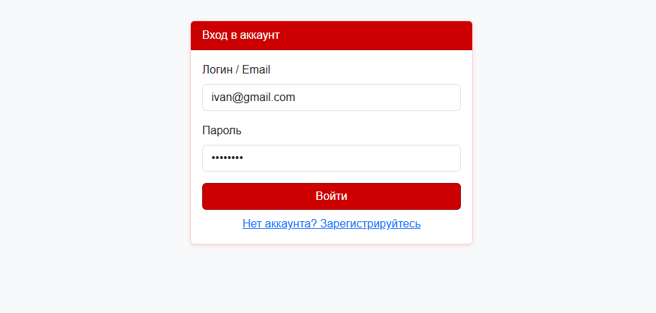

# Пожарная Безопасность — сайт компании

## Описание
Веб-приложение для компании, предоставляющей услуги в области пожарной безопасности.

## Использованные технологии
- **PHP 7.4+** — серверный язык  
- **MySQL** — база данных  
- **HTML5, CSS3** — вёрстка  
- **JavaScript** — интерактивность  
- **Bootstrap 5** — адаптивный дизайн  
- **PDO** — работа с БД

## Реализованный функционал

- Регистрация и авторизация пользователей  
- Разграничение прав доступа (администратор / пользователь)  
- Просмотр списка услуг  
- Оформление заявки на услугу  
- Форма обратной связи на странице "Контакты" (сообщения сохраняются в БД)
- Административная панель:  
  - Управление услугами (CRUD)  
  - Управление сертификатами (CRUD)  
  - Просмотр заявок пользователей  
  - Управление пользователями (назначение прав)  
- Валидация данных на стороне сервера  
- Слайдер на главной странице  
- Модальное окно после отправки заявки

## Скриншоты

### Главная страница


### О нас


### Услуги


### Контакты


### Форма заявки


### Отправленная заявка (модальное окно)


### Админ-панель


### Вход


## Структура проекта

```
fire-safety/
├── public/                          # Корневая папка сайта (DocumentRoot)
│   ├── admin/                       # Административная панель
│   │   ├── certificates.php
│   │   ├── index.php
│   │   ├── logout.php
│   │   ├── requests.php
│   │   ├── services.php
│   │   └── users.php
│   ├── assets/                      # Стили, скрипты, шрифты
│   │   ├── css/
│   │   │   ├── bootstrap.css
│   │   │   ├── bootstrap-icons.css
│   │   │   └── fonts/
│   │   │       ├── bootstrap-icons.woff
│   │   │       └── bootstrap-icons.woff2
│   │   ├── js/
│   │   │   └── bootstrap.bundle.js
│   │   └── style.css
│   ├── database/                    # Дамп базы данных
│   │   └── pozharka.sql
│   ├── includes/                    # Подключаемые файлы
│   │   ├── auth.php
│   │   └── db.example.php           # Пример конфигурации БД
│   ├── uploads/                     # Загружаемые изображения (игнорируется Git)
│   ├── .htaccess
│   ├── about.php                    # Страница "О нас"
│   ├── contacts.php                 # Страница "Контакты" с формой обратной связи
│   ├── index.php                    # Главная страница со слайдером
│   ├── login.php                    # Вход в аккаунт
│   ├── logout.php                   # Выход из аккаунта
│   ├── register.php                 # Регистрация
│   ├── services.php                 # Список услуг
│   └── submit_request.php           # Форма оформления заявки
├── screenshots/                     # Скриншоты для README
│   ├── main.png
│   ├── services.png
│   ├── submit_request.png
│   ├── submit_request_done.png
│   ├── admin.png
│   └── login.png
├── .gitignore
└── README.md
```

## Установка

1. Клонируйте репозиторий
2. Создайте базу данных MySQL
3. Импортируйте `pozharka.sql`
4. Настройте `includes/db.php`
5. Откройте сайт

## Тестовые данные
- Админ: `admin` / `12345678`
- Пользователь: `ivan@gmail.com` / (пароль сбросьте через phpMyAdmin)

